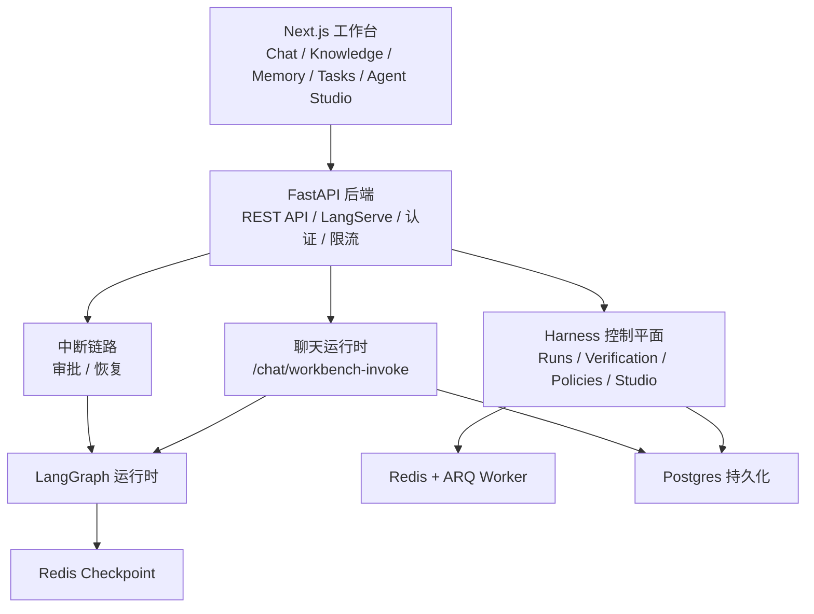

<div align="center">
  <h1>🚀 AgFrame</h1>
</div>

<div align="center">
  
  
  
  
  
</div>

<div align="center">
  <b>后端自管聊天运行时、Harness 控制平面与 Agent Studio 工作台</b>
</div>

---


## 项目定位

AgFrame 当前由三层核心能力构成：

- **聊天运行时**：基于 FastAPI + LangGraph，主链路通过后端自管的 workbench invoke 完成调用与消息持久化。
- **Harness 控制平面**：统一管理 run、审批、验证、重试、事件证据、运行时状态历史与模型提供方。
- **工作台前端**：基于 Next.js 的操作台，覆盖 chat、knowledge、conversations、memory、tasks、settings，以及独立的 Harness Agent Studio。

当前仓库的重点已经不是单一的 RAG Demo，而是可审计、可恢复、可扩展的 Agent Runtime 平台。

## 架构快照



### 运行时形态

- **后端 API**：`app/server/main.py` 负责挂载 FastAPI 路由、LangServe `/chat`、静态文件、认证和限流。
- **聊天链路**：`POST /chat/workbench-invoke` 是工作台主入口，由后端统一注入运行时配置、调用图执行并持久化消息。
- **Harness 链路**：`app/server/api/harness.py` 覆盖 runs、studio projects、skill requests、approvals、verification、runtime-state history 和 model providers。
- **异步执行**：ARQ Worker 负责文档入库、harness run 执行和 harness resume。
- **前端结构**：`frontend/` 使用 Next.js App Router、React Query、共享 HTTP Client 和领域化 hooks。

### 默认检索链路

```text
Query
  -> Dense Search + BM25 Search
  -> RRF Fusion
  -> Candidate Pruning
  -> Parent Restore
  -> Prompt Assembly
```

当前推荐默认值：

- 主路径保留 `Dense + BM25 + RRF`
- 在组装 Prompt 前执行轻量裁剪
- `reranker.*` 仅作为兼容配置保留，不是默认链路

## 仓库结构

```text
app/
  server/           FastAPI 入口、REST API、聊天运行时集成
  runtime/          LangGraph 图、状态、Prompt、恢复服务
  harness/          Harness 协议、持久化、运行时服务
  infrastructure/   配置、数据库、队列、checkpoint、通用工具
  memory/           长期记忆引擎与 pgvector 集成
frontend/           Next.js 工作台与 Agent Studio
docs/               正式技术文档
scripts/            冒烟测试、安全扫描、报告生成脚本
tests/              API、Harness、Runtime 与 Smoke 回归测试
```

## 快速开始

### 1. 安装依赖

```bash
uv sync
cd frontend && npm install
```

可选依赖组：

- `uv sync --group document-ai`
- `uv sync --group evals`

### 2. 准备本地配置

```bash
cp .env.example .env
cp configs/config.example.json configs/config.json
```

启动前至少完成以下安全配置：

- `AUTH_SECRET_KEY`
- `DATABASE_URL` 或 `DB_*`
- `DB_PASSWORD`
- 使用云端模型时配置 `LLM_API_KEY`

说明：

- `docker-compose.yml` 只有在 `.env` 未覆盖时才会回退到 `LLM_MODEL=dev-stub`
- `.env.example` 当前默认写的是 `LLM_MODEL=gpt-4o-mini`，如果要在无云端 Key 的情况下跑本地 live smoke，需要自行调整 `.env`

### 3. 使用 Docker Compose 启动整套服务

```bash
docker compose up --build -d
docker compose ps
```

默认服务：

- `postgres`
- `redis`
- `backend`
- `worker`
- `frontend`

默认访问地址：

- Frontend: `http://127.0.0.1:3000`
- API: `http://127.0.0.1:8000`
- Swagger: `http://127.0.0.1:8000/docs`

可选观测组件：

```bash
docker compose --profile observability up --build -d
```

### 4. 手动启动服务

Backend：

```bash
./.venv/bin/python -m app.server.main
```

Worker：

```bash
./.venv/bin/arq app.infrastructure.queue.worker_settings.WorkerSettings
```

Frontend：

```bash
cd frontend
export NEXT_PUBLIC_API_URL=http://127.0.0.1:8000
npm run dev
```

## 主要能力

- **对话工作台**：后端自管 invoke 流程，支持会话持久化与 interrupt 恢复
- **Harness Runs**：创建执行、查看事件、读取验证证据、处理审批、发起重试
- **Harness Agent Studio**：管理项目、维护 graph JSON、发起技能申请、处理技能审批、启动编排运行
- **知识入库**：上传文件、排队解析建索引、重建文档、跟踪任务状态
- **记忆与历史**：维护长期画像、原子记忆条目和会话历史
- **模型提供方管理**：增删改查 harness model providers

## 健康检查与运行时信号

关键健康接口：

- `GET /health`
- `GET /health/ready`
- `GET /health/live`

`/health/ready` 会报告检索链路和依赖项的就绪情况，包括 DB、Redis 与当前轻量检索路径状态。

## 文档导航

- [部署指南](./docs/deployment-cn.md)
- [API 文档](./docs/api-cn.md)
- [测试指南](./docs/testing-cn.md)
- [安全说明](./docs/security-cn.md)
- [前端架构](./docs/frontend-architecture-cn.md)
- [RAG 架构](./docs/rag-architecture-cn.md)
- [文档治理规范](./docs/documentation-governance-cn.md)

## 版本范围

- 后端版本：`0.3.1`
- 前端版本：`0.3.1`
- Python 约束：`>=3.11,<3.12`
- 本 README 已按 2026-03-30 的仓库状态校准
