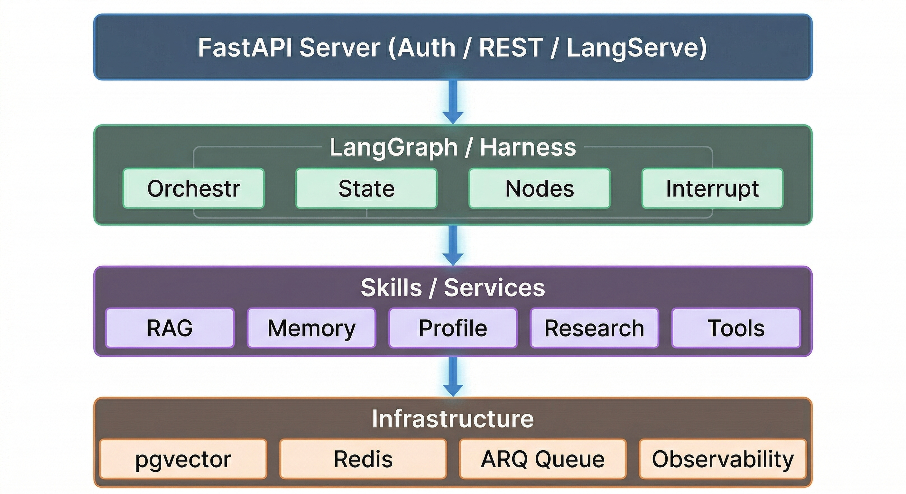

<div align="center">
  <h1>🚀 AgFrame (Agent Framework)</h1>
</div>

<div align="center">
  
  
  
  
  
</div>

<div align="center">
  <a href="README-CN.md">中文文档</a>
</div>

<div align="center">
  <b>⚡ Production-Grade Agent/RAG Backend Framework | Built on FastAPI + LangGraph</b><br>
  Focuses on complex workflow orchestration, lightweight hybrid retrieval, hierarchical memory, and observability
</div>

---

```text
  █████   ██████  ███████ ██████   █████  ███    ███ ███████
 ██   ██ ██       ██      ██   ██ ██   ██ ████  ████ ██
 ███████ ██   ███ █████   ██████  ███████ ██ ████ ██ █████
 ██   ██ ██    ██ ██      ██   ██ ██   ██ ██  ██  ██ ██
 ██   ██  ██████  ██      ██   ██ ██   ██ ██      ██ ███████
```

---

## ✨ Core Features Quick Look

| 🏗️ Workflow Orchestration | 🧠 Lightweight RAG | 💾 Hierarchical Memory | 🔮 LLM Factory | 📊 Observability | 🛠️ Infrastructure |
|:---:|:---:|:---:|:---:|:---:|:---:|
| LangGraph | Dual Retrieval (Dense+BM25) | Short-term Dialog Window | Multi-Model Support | Langfuse | Redis Worker |
| Harness Runtime | RRF Rank Fusion | Long-term Profile Update | Embedding Models | Task Diagnostic Queue | PostgreSQL |
| Human-in-Loop | Context Lightweight Pruning | pgvector Retrieval | Structured Output | Checkpoint Tracking | Docker Orchestration |

---

## 📐 Architecture Overview



## 📂 Directory Structure

```
╭────────────────────────────────────────────────────────────────────────────╮
│                              AgFrame /                                     │
╰────────────────────────────────────────────────────────────────────────────╯
│
├── app/
│   ├── server/              # 🚀 FastAPI Entry
│   │   ├── api/             #   Routing Layer
│   │   └── main.py          #   Application Start
│   ├── runtime/             # ⚙️ Runtime Core
│   │   ├── graph/           #   LangGraph Workflow
│   │   │   ├── graph.py     #   Graph Definition
│   │   │   ├── state.py     #   State Schema
│   │   │   ├── orchestrator.py # Orchestrator
│   │   │   ├── registry.py  #   Node Registry
│   │   │   └── nodes/       #   Node Implementation
│   │   ├── llm/             #   LLM Factory
│   │   └── prompts/         #   Prompt Templates and Pruning Strategy
│   ├── skills/              # 🛠️ Atomic Skills Layer
│   │   ├── rag/             #   Hybrid Retrieval
│   │   ├── memory/          #   Memory Retrieval Skills
│   │   ├── profile/         #   User Profile
│   │   ├── research/        #   Web Search
│   │   ├── ocr/             #   Image OCR
│   │   ├── common/          #   Common Skills
│   │   └── tools/           #   Code Execution
│   ├── infrastructure/      # 🏗️ Infrastructure
│   │   ├── config/          #   Configuration Management
│   │   ├── database/        #   SQLAlchemy ORM
│   │   ├── checkpoint/      #   Redis Checkpoint
│   │   ├── queue/           #   ARQ Async Tasks
│   │   ├── sandbox/         #   Code Sandbox
│   │   ├── observability/   #   Observability
│   │   └── utils/           #   Utility Functions
│   ├── agents/              # 🤖 Agent Node Factory
│   ├── memory/              # 🧠 Memory Module
│   │   ├── long_term/       #   Long-term Memory Engine
│   │   └── vector_stores/   #   Vector Stores (pgvector)
│   └── examples/            # 🔬 Debug Scripts and Examples
│
├── configs/                 # ⚙️ Configuration Files
├── docker/                 # 🐳 Docker Initialization Scripts
├── docs/                   # 📖 Deployment/Architecture/Security/Testing Docs
├── frontend/               # 💻 Next.js Workbench Frontend
├── scripts/                # 🧰 Tools and Smoke Test Scripts
├── data/                   # 📁 Runtime Data
├── tests/                  # 🧪 Unit Tests and Evaluations
│
├── docker-compose.yml      # 🐳 Infrastructure Orchestration
├── pyproject.toml         # 🐍 Python Project Configuration
└── uv.lock                 # 🔒 Dependency Lock File
```

## Default Retrieval Pipeline

```text
Query
  -> Dense Search + BM25 Search
  -> RRF Fusion
  -> Candidate Pruning (Lightweight Candidate Pruning)
  -> Parent Restore (Parent Document Restoration)
  -> Prompt Assembly (Assemble Prompt)
```

Current recommended best practices:
- Only retain `Dense + BM25 + RRF` in the main document retrieval path
- Use a lightweight pruning strategy before assembling the Prompt
- Treat the LLM-based Reranker as a legacy compatibility component, not a default requirement

## 🚀 Quick Start

### 1. Environment Installation

```bash
uv python install 3.11
uv sync
```

Optional dependency groups:
- `uv sync --group document-ai`: High-precision PDF / Office document parsing capabilities
- `uv sync --group evals`: Offline evaluation and Benchmark tools

The default installation now includes local Embedding / OCR / Transformers / Torch runtime dependencies, so you can directly use the local inference pipeline after `uv sync`.

### 2. Configuration Instructions

```bash
cp configs/config.example.json configs/config.json
```

At least the following configurations need to be updated:
- `auth.secret_key`
- `database.url` or database credentials
- `llm.api_key` (if using cloud models)

Lightweight recommended configuration reference:

```json
{
  "embeddings": {
    "model_name": "Qwen/Qwen3-Embedding-0.6B"
  },
  "rag": {
    "retrieval": {
      "mode": "hybrid",
      "dense_k": 20,
      "sparse_k": 20,
      "candidate_k": 20,
      "final_k": 3,
      "rrf_k": 60
    }
  },
  "prompt": {
    "context_pruning": {
      "enabled": true,
      "method": "auto"
    }
  },
  "reranker": {
    "model_name": ""
  }
}
```

### 3. Start the Full Stack with Docker Compose

```bash
cp .env.example .env
docker compose up --build -d
```

By default, it will start:
- `postgres`
- `redis` (based on Redis Stack, providing queues, rate limiting, and RediSearch capabilities required for LangGraph checkpoint)
- `backend`
- `worker`
- `frontend`

Default access addresses:
- Frontend: `http://127.0.0.1:3000`
- API: `http://127.0.0.1:8000`
- Swagger Docs: `http://127.0.0.1:8000/docs`

Instructions:
- If you want to use the chat capability directly, please fill in `LLM_API_KEY` in `.env`
- If you want to enable document ingestion / RAG, it is still recommended to supplement the embeddings configuration or remote embeddings service address in `configs/config.json`

Optional observability components:

```bash
docker compose --profile observability up --build -d
```

This will additionally start `clickhouse`, `minio`, `langfuse-server`, `langfuse-worker`.
Langfuse is exposed by default at `http://127.0.0.1:3001`.

### 4. Start Backend API Manually

```bash
uv run python -m app.server.main
```

### 5. Start Async Worker Manually

```bash
uv run arq app.infrastructure.queue.worker_settings
```

## 🩺 Health Check & Runtime Signals

The `readiness` endpoint will expose the current lightweight retrieval status and Harness engine status:
- `components.retrieval == "hybrid_rrf"`
- `components.context_pruning == "lightweight_ranker"`

The `reranker` component is retained for backward compatibility, but the default retrieval path no longer strongly depends on it.

## 📖 Documentation Guide

- [Deployment Guide](./docs/deployment.md)
- [RAG Architecture & Migration](./docs/rag-architecture.md)
- [Testing Guide](./docs/testing.md)
- [Frontend Architecture](./docs/frontend-architecture.md)
- [Security Notes](./docs/security.md)
- [Roadmap](./docs/roadmap.md)

## 📌 Current Status

The current codebase reflects the latest lightweight RAG and Agent orchestration design:
- Document retrieval has completely removed the hard dependency on Model Reranker
- Memory retrieval uses lightweight local scoring and ranking
- Context pruning uses lightweight ranking / heuristic scoring
- **(v0.2.1)** Introduced Harness execution engine, supporting LangGraph task Interrupt and Checkpoint approval resumption
- Basic configuration items and health reports are all consistent with this lightweight, highly controllable pipeline