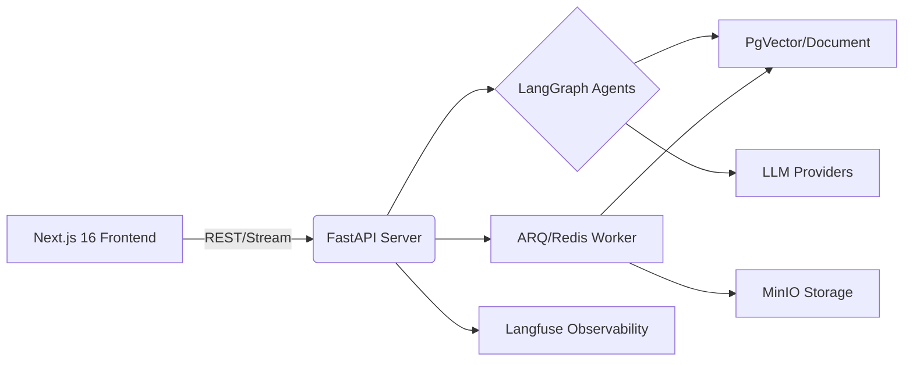

# 🚀 AgFrame (Agent Framework)


**⚡ 生产级 Agent/RAG 后端框架 | 基于 FastAPI + LangGraph 构建**  
专注于复杂工作流编排、混合检索、分层记忆与可观测性

---

```text
  █████   ██████  ███████ ██████   █████  ███    ███ ███████
 ██   ██ ██       ██      ██   ██ ██   ██ ████  ████ ██
 ███████ ██   ███ █████   ██████  ███████ ██ ████ ██ █████
 ██   ██ ██    ██ ██      ██   ██ ██   ██ ██  ██  ██ ██
 ██   ██  ██████  ██      ██   ██ ██   ██ ██      ██ ███████
```

---

## ✨ 核心特性速览

| 🏗️ 工作流编排 | 🧠 混合 RAG | 💾 分层记忆 | 🔮 LLM 工厂 | 📊 可观测性 | 🛠️ 基础设施 |
|:---:|:---:|:---:|:---:|:---:|:---:|
| LangGraph | 双路检索 | 短期+长期 | 多模型支持 | Langfuse | Redis |
| Checkpoint | RRF 融合 | pgvector | 嵌入模型 | DeepEval | PostgreSQL |
| Human-in-Loop | 重排序 | 用户画像 | 结构化输出 | 任务诊断 | Docker |

---

## 📐 架构总览

**AgFrame** 不仅仅是一个后端脚手架，而是一个**开箱即用、具备生产级可用性**的 AI 基础设施平台。它集成了 FastAPI、LangGraph、Next.js，并辅以 PgVector、Redis、ARQ、Langfuse 等全套中间件，帮助你快速构建、部署和维护复杂的 AI 应用。

### 🧰 技术栈

| **领域**     | **核心组件**                                                                 |
| :----------- | :--------------------------------------------------------------------------- |
| **后端 API**   | `Python 3.11+`, `FastAPI`, `LangGraph`, `LangServe`, `SQLAlchemy`, `ARQ`     |
| **前端应用**   | `Next.js 16`, `React 19`, `TypeScript`, `React Query`, `Zod`, `Hook Form`    |
| **存储队列**   | `PostgreSQL + pgvector`, `Redis`, `RabbitMQ` (预留), `MinIO`                 |
| **观测基石**   | `Langfuse`, `ClickHouse`                                                     |



---

## 📁 项目结构 / Structure

<details>
<summary><b>点击展开目录树</b></summary>
<br>

```text
AgFrame/
├─ app/
│  ├─ server/                # FastAPI 入口与 API 路由
│  ├─ runtime/               # LangGraph / LLM / Prompt 运行时
│  ├─ skills/                # RAG、Memory、Research、Tools 等能力
│  ├─ infrastructure/        # 配置、数据库、队列、日志、观测
│  ├─ memory/                # 长期记忆与向量存储
│  ├─ agents/                # Agent 节点工厂
│  └─ examples/              # 示例与验证脚本
├─ frontend/                 # Next.js 工作台
├─ configs/                  # 配置文件
├─ docker/                   # Docker 初始化资源
├─ docs/                     # 补充文档
├─ scripts/                  # 测试、冒烟、评测、worker 启动脚本
├─ tests/                    # 测试
├─ docker-compose.yml
└─ pyproject.toml
```
</details>

---

## ⚡ 核心特性

### 🏗️ 工作流编排 (LangGraph)

| 特性 | 说明 |
|:---|:---|
| **Stateful Graph** | 支持循环、分支、条件判断 |
| **Checkpoint** | Redis 持久化断点恢复 |
| **Human-in-the-Loop** | 支持人工中断与反馈 |
| **节点注册表** | 动态节点管理 |

### 🧠 混合 RAG

| 特性 | 说明 |
|:---|:---|
| **双路检索** | BM25 (关键词) + Embedding (语义) |
| **重排序** | 支持 Cross-Encoder 重排序 |
| **多格式解析** | PDF/DOCX/Excel/图片 OCR |
| **RRF 融合** | RRF 排序融合算法 |

### 💾 分层记忆系统

| 特性 | 说明 |
|:---|:---|
| **短期记忆** | 对话上下文窗口管理 |
| **长期记忆** | 用户画像 + 历史向量存储 |
| **pgvector** | 向量检索持久化 |
| **对话管理** | 历史记录持久化 |

### 🔮 LLM 工厂

| 特性 | 说明 |
|:---|:---|
| **多模型支持** | OpenAI API / 本地 Qwen (Ollama/VLLM) |
| **嵌入模型** | Sentence-Transformers / ModelScope |
| **重排序** | Cross-Encoder |
| **结构化输出** | 原生 Pydantic + JSON 模式 |

### 📊 可观测性

| 特性 | 说明 |
|:---|:---|
| **Langfuse** | 全链路追踪、Prompt 管理 |
| **DeepEval** | RAG 评测 (Context Recall/Precision) |
| **任务运营** | 任务摘要、失败事件流、结构化诊断 |
| **事件处置** | 支持事件已处理/归档与筛选 |

### 🛠️ 基础设施

| 特性 | 说明 |
|:---|:---|
| **Redis** | 缓存 / Checkpoint / 任务队列 (ARQ) |
| **PostgreSQL** | 持久化存储 |
| **Docker** | 一键启动全部依赖 |
| **Sandbox** | 代码安全执行环境 |

## 🆕 最新进展

本轮迭代已补齐一组更接近生产可用的后端能力：

| 模块 | 新增功能 |
|:---|:---|
| 📚 **知识库管理** | 文档列表、搜索、详情、预览、删除、重建索引 |
| 💬 **会话中心** | 会话查询、详情、重命名、删除 |
| 🧠 **记忆控制台** | 画像查看/更新、长期记忆查看/新增/删除 |
| 📋 **任务运营** | 任务诊断、超时疑似标记、失败重试、事件流、事件归档/已处理 |
| ❤️ **健康检查** | 数据库、Redis、向量库、模型组件配置检查 |
| ✅ **真实依赖验证** | PostgreSQL、Redis、远端 vLLM embedding/reranker 已完成集成验证 |
| 🎯 **服务级验收** | 已提供 smoke 脚本，覆盖注册、登录、上传、索引、文档、会话、记忆主链路 |
| 💻 **前端工作台** | `/login`、`/chat`、`/knowledge`、`/conversations`、`/memory`、`/tasks`、`/settings`、`/admin/settings` 已实现并对齐后端 |
| 🛡️ **前端门禁** | Node 22 环境下 `npm run lint` 与 `npx next build` 已通过 |

---

## 🚀 快速开始 / Quick Start

### 1. 准备环境与依赖

本项目推荐使用 [uv](https://github.com/astral-sh/uv) 进行 Python 环境与依赖管理：

```bash
uv python install 3.11
uv sync
```

说明：
- 默认会创建 `.venv/` 并安装开发依赖
- 如需显式指定 Python 3.11，可先执行 `uv python install 3.11`
- 常用命令建议统一使用 `uv run ...`

### 2. 核心配置

复制配置模板并修改其中的敏感信息与连接串：

```bash
cp configs/config.example.json configs/config.json
```
*(Windows PowerShell 请使用 `Copy-Item configs/config.example.json configs/config.json`)*

**⚠️ 必须修改的配置项：**
- `auth.secret_key` (至少 32 个字符)
- `database.password` (避免使用弱密码)
- `llm.api_key`

完整样例请直接参考 `configs/config.example.json`。

**环境变量覆盖**：
*提示：也可以通过环境变量形如 `AUTH_SECRET_KEY` 来覆盖 JSON 配置。*

配置示例（关键字段）：

```json
{
  "llm": {
    "api_key": "",
    "base_url": "https://api.openai.com/v1",
    "model": "gpt-4o"
  },
  "embeddings": {
    "provider": "modelscope",
    "model_name": "Qwen/Qwen3-Embedding-0.6B"
  },
  "reranker": {
    "provider": "modelscope",
    "model_name": "Qwen/Qwen3-Reranker-0.6B"
  },
  "database": {
    "url": "postgresql+psycopg://<DB_USER>:<DB_PASSWORD>@localhost:5432/<DB_NAME>"
  },
  "queue": {
    "redis_url": "redis://:redissecret@localhost:6379/0"
  },
  "auth": {
    "secret_key": "<AUTH_SECRET_KEY_AT_LEAST_32_CHARS>"
  }
}
```

### 3. 一键启动基础设施

使用 Docker Compose 快速拉起数据库、缓存、对象存储和可观测性组件：

```bash
docker-compose up -d
```

| 🔌 服务 | 🚪 端口 | 📝 用途 |
|:---|:---:|:---|
| PostgreSQL + pgvector | 5432 | 主数据库 + 向量存储 |
| Redis | 6379 | 缓存、Checkpoint、任务队列 |
| RabbitMQ | 5672/15672 | 预留消息队列（当前 ARQ 不依赖） |
| ClickHouse | 8123 | Langfuse 指标存储 |
| MinIO | 9000/9001 | S3 对象存储 |
| Langfuse | 3000 | 可观测性追踪 |

初始化 MinIO 存储桶：
```bash
docker-compose exec minio mc mb local/agframe
```

### 4. 启动后端与 Worker

**API 服务器 (端口: 8000)**
```bash
uv run python -m app.server.main
```

**异步 Worker (处理文档解析等任务)**
```bash
uv run arq app.infrastructure.queue.worker_settings
```

后端服务运行在 `http://localhost:8000`

### 5. 启动前端工作台

```bash
cd frontend
export NEXT_PUBLIC_API_URL="http://127.0.0.1:8000"
npm install
npm run dev
```

前端启动后，打开 [http://127.0.0.1:3000](http://127.0.0.1:3000) 即可访问。

### ⏹️ 停止服务

```bash
# 停止所有基础设施
docker-compose down

# 停止并删除数据卷（慎用！）
docker-compose down -v
```

---

## 🔌 核心 API 清单 / API Reference

<details>
<summary><b>点击查看详细 API 列表</b></summary>
<br>

| 方法 | 路径 | 说明 |
| :--- | :--- | :--- |
| `POST` | `/auth/register` | 用户注册 (首个用户自动为 admin) |
| `POST` | `/auth/token` | 登录并获取 Bearer Token |
| `GET` | `/auth/users/me` | 当前用户信息 |
| `GET` | `/health` | 健康检查 |
| `GET` | `/health/ready` | 就绪检查 |
| `GET` | `/health/live` | 存活检查 |
| `POST` | `/chat/invoke` | 对话调用 |
| `POST` | `/chat/stream` | LangServe 对话流调用 |
| `POST` | `/chat/batch` | LangServe 批量对话调用 |
| `POST` | `/upload` | 上传 PDF 并异步解析入库 |
| `POST` | `/upload/image` | 上传图片 |
| `GET` | `/documents` | 文档列表 / 搜索 |
| `GET` | `/documents/{doc_id}` | 文档详情与预览 |
| `DELETE` | `/documents/{doc_id}` | 删除文档 |
| `POST` | `/documents/{doc_id}/reindex` | 文档重建索引 |
| `GET` | `/tasks/summary` | 任务聚合摘要 |
| `GET` | `/tasks/incidents` | 任务事件流 |
| `PATCH` | `/tasks/incidents/{incident_id}` | 标记事件处理状态 |
| `GET` | `/tasks/{task_id}` | 任务详情与诊断 |
| `POST` | `/tasks/{task_id}/retry` | 重试失败任务 |
| `GET` | `/history/{user_id}` | 会话列表 |
| `GET` | `/history/{user_id}/{session_id}` | 会话详情 |
| `POST` | `/history/{user_id}/save` | 保存会话 |
| `PATCH` | `/history/{user_id}/{session_id}` | 重命名会话 |
| `DELETE` | `/history/{user_id}/{session_id}` | 删除会话 |
| `GET` | `/memory/profile` | 查看明细画像详情与长期记忆 |
| `PUT` | `/memory/profile` | 更新用户画像 |
| `GET` | `/memory/items` | 查询长期记忆 |
| `POST` | `/memory/items` | 新增长期记忆 |
| `DELETE` | `/memory/items/{item_id}` | 删除长期记忆 |
| `GET` | `/settings` | 获取系统设置（Admin） |
| `POST` | `/settings` | 更新系统设置（Admin） |
| `GET` | `/settings/user` | 获取个人设置 |
| `POST` | `/settings/user` | 更新个人设置 |
| `POST` | `/vectorstore/docs/clear` | 清空文档向量库（Admin） |

</details>

---

## 🔧 开发指南

### 🆕 新增 Skill 流程

1. **定义能力** → `app/skills/<领域>/<能力>.py`
2. **注册节点** → `app/runtime/graph/nodes/<节点>.py`
3. **编排流程** → `app/runtime/graph/graph.py` 更新 Graph
4. **验证** → `python -m app.examples.graph_demo`

### ⚙️ 配置管理

```python
from app.infrastructure.config.settings import settings

# 访问配置（类型安全）
llm_model = settings.llm.model
db_host = settings.database.host

# 或获取字典格式
config = settings.model_dump()
```

### 🧪 测试与验收

```bash
# 运行本地回归
uv run ./scripts/run_test_suite.sh

# 运行双桩 smoke
uv run ./scripts/smoke_workbench.sh

# 对运行中的服务执行 live smoke
uv run ./scripts/live_workbench_smoke.sh --base-url http://127.0.0.1:8000
```

### 📈 运行评测

```bash
# 运行所有评估与测试
uv run ./scripts/run_evals.sh
```

---

## 📖 文档索引

- [部署说明](./docs/deployment.md)
- [安全说明](./docs/security.md)
- [测试指南](./docs/testing.md)
- [前端架构](./docs/frontend-architecture.md)
- [项目路线图](./docs/roadmap.md)

---

<div align="center">
  <p><b>Version</b>: <code>0.1.1</code></p>
  <p><i>Made with passion for the Agentic future.</i></p>
</div>
