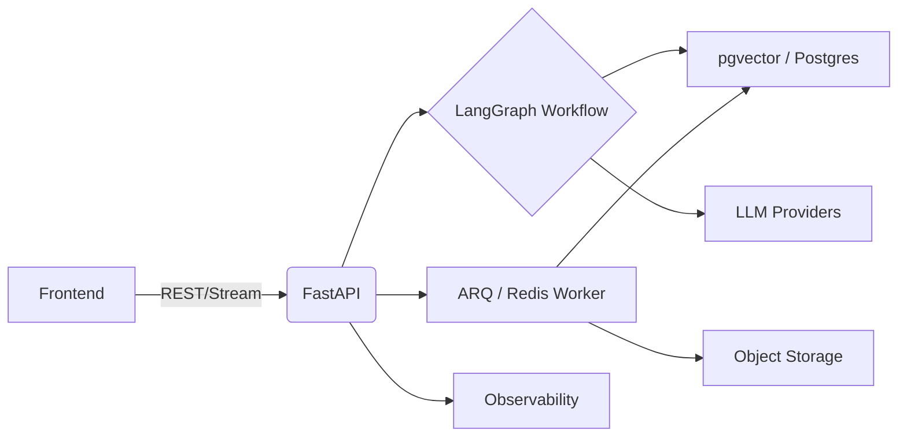

# AgFrame

Production-ready Agent / RAG backend built with FastAPI and LangGraph.

AgFrame focuses on a lightweight retrieval stack:

- Dense search + BM25
- RRF fusion
- lightweight context pruning
- long-term memory and workflow orchestration

It is designed for teams that want a transparent, controllable RAG backend instead of a heavily wrapped pipeline.

## Highlights

- Lightweight Hybrid RAG: concurrent dense and sparse retrieval with RRF fusion
- Practical ingestion: PDF, DOCX, Excel, text, markdown, OCR fallback
- Parent-child retrieval: retrieve small chunks, restore larger parent context
- Memory support: profile memory and chat-summary retrieval
- Agent workflow runtime: LangGraph-based orchestration with FastAPI APIs
- Operations ready: health checks, smoke scripts, evaluation scripts, task diagnostics

## Default Retrieval Path

```text
Query
  -> Dense Search + BM25 Search
  -> RRF Fusion
  -> Candidate Pruning
  -> Parent Restore
  -> Prompt Assembly
```

Current recommendations:

- Keep only `Dense + BM25 + RRF` in the main document retrieval path
- Use lightweight pruning before prompt assembly
- Treat model-based rerankers as legacy-compatible, not default

## Architecture



## What Is Included

- API server: FastAPI
- Workflow runtime: LangGraph
- Storage: PostgreSQL + pgvector, Redis
- Frontend workspace: Next.js
- Evaluation and smoke tooling: pytest, smoke scripts, pruning eval scripts

## Quick Start

### 1. Install

```bash
uv python install 3.11
uv sync
```

Optional groups:

- `uv sync --group document-ai`: higher-accuracy PDF / Office parsing
- `uv sync --group evals`: offline evaluation and benchmark tooling
- `uv sync --group local-inference`: local embeddings / OCR, or legacy reranker compatibility

### 2. Configure

```bash
cp configs/config.example.json configs/config.json
```

At minimum, update:

- `auth.secret_key`
- `database.url` or database credentials
- `llm.api_key` if using a hosted model

Recommended lightweight settings:

```json
{
  "embeddings": {
    "model_name": "Qwen/Qwen3-Embedding-0.6B"
  },
  "rag": {
    "retrieval": {
      "mode": "hybrid",
      "dense_k": 20,
      "sparse_k": 20,
      "candidate_k": 20,
      "final_k": 3,
      "rrf_k": 60
    }
  },
  "prompt": {
    "context_pruning": {
      "enabled": true,
      "method": "auto"
    }
  },
  "reranker": {
    "model_name": ""
  }
}
```

### 3. Start Dependencies

```bash
docker-compose up -d
```

### 4. Start Backend

```bash
uv run python -m app.server.main
```

### 5. Start Worker

```bash
uv run arq app.infrastructure.queue.worker_settings
```

Backend default address:

- API: `http://127.0.0.1:8000`
- Swagger: `http://127.0.0.1:8000/docs`

## Health / Runtime Signals

The readiness endpoint exposes the current lightweight retrieval posture:

- `components.retrieval == "hybrid_rrf"`
- `components.context_pruning == "lightweight_ranker"`

The `reranker` component is still exposed for backward compatibility, but it is not required by the default retrieval path.

## Documentation

- [Deployment Guide](./docs/deployment.md)
- [RAG Architecture](./docs/rag-architecture.md)
- [RAG Migration Guide](./docs/rag-migration.md)
- [Testing Guide](./docs/testing.md)
- [Frontend Architecture](./docs/frontend-architecture.md)
- [Security Notes](./docs/security.md)
- [Roadmap](./docs/roadmap.md)

## Status

Current codebase status reflects the lightweight design:

- document retrieval no longer depends on a model reranker
- memory retrieval uses lightweight local ranking
- context pruning uses lightweight ranking / heuristic scoring
- configuration and health reporting are aligned with the lightweight path
